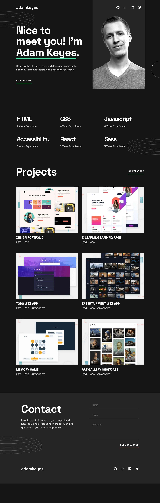
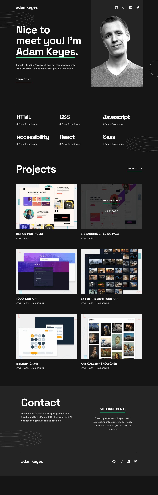
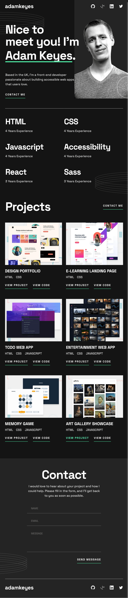
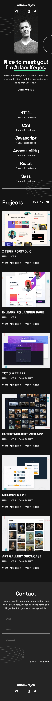

# Frontend Mentor - Single-page developer portfolio solution

This is a solution to the [Single-page developer portfolio challenge on Frontend Mentor](https://www.frontendmentor.io/challenges/singlepage-developer-portfolio-bBVj2ZPi-x). Frontend Mentor challenges help you improve your coding skills by building realistic projects.

## Table of contents

- [Overview](#overview)
  - [The challenge](#the-challenge)
  - [Screenshots](#screenshots)
  - [Links](#links)
- [My process](#my-process)
  - [Built with](#built-with)
  - [What I learned](#what-i-learned)
  - [Useful resources](#useful-resources)
- [Author](#author)

## Overview

### The challenge

Users should be able to:

- Receive an error message when the `form` is submitted if:
  - Any field is empty
  - The email address is not formatted correctly
- View the optimal layout for the interface depending on their device's screen size
- See hover and focus states for all interactive elements on the page
- **Bonus**: Hook the form up so it sends and stores the user's enquiry (you can use a spreadsheet or Airtable to save the enquiries)
- **Bonus**: Add your own details (image, skills, projects) to replace the ones in the design

### Screenshots

Desktop

---

Tablet

---

Mobile

### Links

- Solution URL: [https://github.com/mihalymarcell86/single-page-developer-portfolio](https://github.com/mihalymarcell86/single-page-developer-portfolio)
- Live Site URL: [https://single-page-developer-portfolio-six.vercel.app/](https://single-page-developer-portfolio-six.vercel.app/)

## My process

### Built with

- Semantic HTML5 markup
- Sass, [CSSModules](https://github.com/css-modules/css-modules)
- Mobile-first workflow

- [React](https://reactjs.org/) - JS library
- [react-scroll](https://www.npmjs.com/package/react-scroll) - React component for animating vertical scrolling
- [validator](https://www.npmjs.com/package/validator) - A library of string validators and sanitizers.

- [Firebase](https://firebase.google.com/)

### What I learned

I ran into some difficulty trying to customize the underlines using the `text-decoration` subproperties. I didn't find a rule that would bring the line in front of the text, as shown in the design, so in the introduction section, I created an absolutely positioned pseudo-element instead. While styling links, `text-underline-offset` looked promising, but unfortunately it doesn't affect the document flow, so I decided to use `border-bottom`.
(Edit: the design is inconsistent, in the desktop layout the underline hides behind the descenders.)

It is impossible to define multiple gap sizes within a grid.

I learned how to dynamically import images with `require()`.

I tried to implement the hover states on the project thumbnails with CSS only, using pseudo-elements and the general sibling combinator, but unfortunately the result turned out to be very laggy, and the hover states of the links on the overlay didn't show. As much as I tried to avoid code duplication, I had to recreate the overlays in new components, to make them work smoothly.

I learned to use `React.cloneElement()` to change properties of elemenent received as props.

I learned about `@layer` and used it to decrease specificity of a set of global rules that would have clashed with some components otherwise.

### Useful resources

- [MDN Web Docs](https://developer.mozilla.org/en-US/)
- [React Docs BETA](https://beta.reactjs.org/)
- [Jack Herrington - UseState: Asynchronous or what?](https://www.youtube.com/watch?v=RAJD4KpX8LA) - This video helped me get a better understanding how React manages state behind the scenes

## Author

- GitHub - [@mihalymarcell86](https://www.github.com/mihalymarcell86)
- Frontend Mentor - [@mihalymarcell86](https://www.frontendmentor.io/profile/mihalymarcell86)
